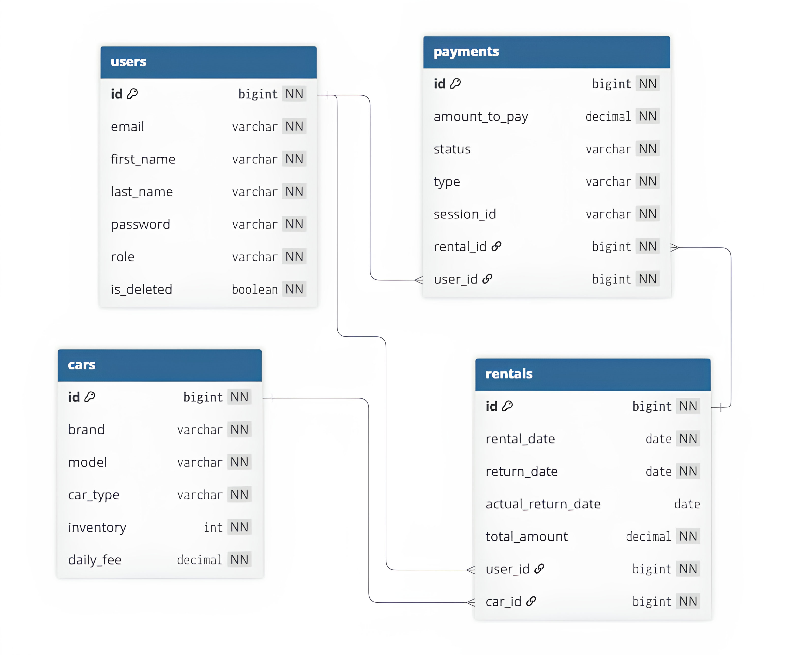

# 🚀 AutoRent – RESTful Backend API for Car Rental Service


AutoRent is a modern RESTful API for managing a car rental platform.

It handles the complete rental lifecycle: from booking vehicles and processing payments to handling returns and penalties.

This project demonstrates a production-ready backend built with stateless JWT authentication, role-based access control, and clean layered architecture.

---

## 📍 Table of Contents

- [🛠️ Tech Stack](#️-tech-stack)
- [🔥 Features](#-features)
- [🧱 Architecture](#-architecture)
- [🧩 Domain Model](#-domain-model)
- [🔐 Security](#-security)
- [📡 API Endpoints](#-api-endpoints)
- [🔄 Example Workflow](#-example-workflow)
- [📖 API Documentation](#-api-documentation)
- [🚀 How to Run](#-how-to-run)

---

## 🛠️ Tech Stack

| Layer              | Technology                  |
|--------------------|-----------------------------|
| Language           | Java 17                     |
| Framework          | Spring Boot                 |
| Security           | Spring Security + JWT       |
| Web                | Spring Web (REST API)       |
| Data Access        | Spring Data JPA + Hibernate |
| Database           | PostgreSQL                  |
| In-Memory DB       | H2                          |
| Migrations         | Liquibase                   |
| Mapping            | MapStruct                   |
| Validation         | Spring Validation           |
| API Docs           | SpringDoc OpenAPI (Swagger) |
| Testing            | JUnit 5, Mockito            |
| Payments           | Stripe API                  |
| Notifications      | Telegram Bot API            |
| Containerization   | Docker                      |

### [⬆ Back to Table of Contents](#-table-of-contents)

---

## 🔥 Features

- 🔐 JWT-based authentication (stateless)
- 👥 Role-based access control (CUSTOMER / MANAGER)
- 🚗 Car inventory management
- 📅 Rental booking system
- 💰 Payment processing (Stripe)
- ⚠️ Fine calculation for late returns
- 📩 Notifications via Telegram
- 🔎 Filtering and pagination
- 📄 Swagger API documentation
- 🐳 Docker support

### [⬆ Back to Table of Contents](#-table-of-contents)

---

## 🧱 Architecture

The project follows a layered architecture:

### Controller → Service → Repository → Database

### Key principles:

- Clear separation of concerns
- DTO usage instead of exposing entities
- MapStruct for mapping
- Transaction management at service layer
- Clean and testable business logic

### [⬆ Back to Table of Contents](#-table-of-contents)

---

## 🧩 Domain Model

### Core entities:

- User
- Car
- Rental
- Payment

### Relationships:

- User & Rental: `One-to-Many` (A user can create multiple rentals over time)

- Rental & Car: `Many-to-One` (Each rental is linked to a specific car)

- Rental & Payment: `One-to-Many` (A rental may include multiple payments, e.g., payments and fines)

- User & Payment: `One-to-Many` (A user can have a history of multiple payments)

### Database Relationship Diagram


### [⬆ Back to Table of Contents](#-table-of-contents)

---

## 🔐 Security

- JWT authentication
- Stateless session management
- Password hashing with BCrypt
- Custom UserDetailsService
- Method-level security with `@PreAuthorize`

### [⬆ Back to Table of Contents](#-table-of-contents)

---

## 📡 API Endpoints

### 🔐 Authentication

| Endpoint         | Method | Description                  |
|------------------|--------|------------------------------|
| `/auth/register` | POST   | Register a new user          |
| `/auth/login`    | POST   | Login and receive JWT token  |

---

### 👤 User Management

| Endpoint           | Method | Description            | Access                     |
|--------------------|--------|------------------------|----------------------------|
| `/users/me`        | GET    | Get my profile info    | CUSTOMER / MANAGER / ADMIN |
| `/users/me`        | PATCH  | Update my profile info | CUSTOMER                   |
| `/users/{id}/role` | PUT    | Update user's role     | **ADMIN**                  |

---

### 🚗 Car Management

| Endpoint               | Method | Description                 | Access  |
|------------------------|--------|-----------------------------|---------|
| `/cars`                | GET    | Get all cars                | PUBLIC  |
| `/cars/{id}`           | GET    | Get car by ID               | PUBLIC  |
| `/cars`                | POST   | Create a new car            | MANAGER |
| `/cars/{id}`           | PATCH  | Update car's specifications | MANAGER |
| `/cars/{id}/inventory` | PATCH  | Update car's inventory      | MANAGER |
| `/cars/{id}`           | DELETE | Delete car                  | MANAGER |

---

### 📅 Rentals

| Endpoint                 | Method | Description                                      | Access             |
|--------------------------|--------|--------------------------------------------------|--------------------|
| `/rentals`               | POST   | Create a rental                                  | CUSTOMER           |
| `/rentals`               | GET    | Get rentals (customer: own, manager: by user id) | CUSTOMER / MANAGER |
| `/rentals/{id}`          | GET    | Get rental by ID (customer: own, manager: any)   | CUSTOMER / MANAGER |
| `/rentals/{id}/return`   | POST   | Return a car (manager can return by user id)     | CUSTOMER / MANAGER |

---

### 💰 Payments

| Endpoint            | Method | Description                                                            | Access             |
|---------------------|--------|------------------------------------------------------------------------|--------------------|
| `/payments`         | POST   | Create payment session                                                 | CUSTOMER           |
| `/payments`         | GET    | Get paginated list of payments (customer: own, manager: any by userId) | CUSTOMER / MANAGER |
| `/payments/success` | GET    | Handle success                                                         | PUBLIC             |
| `/payments/cancel`  | GET    | Handle cancel                                                          | PUBLIC             |

### [⬆ Back to Table of Contents](#-table-of-contents)

---

## 🔄 Example Workflow

1. Register a new user
2. Login and obtain JWT token
3. Browse available cars
4. Create a rental
5. Pay via Stripe
6. Return the car
7. View rental and payment history

### [⬆ Back to Table of Contents](#-table-of-contents)

---

## 📖 API Documentation

After running the app:

http://localhost:8088/api/swagger-ui/index.html


OpenAPI:

http://localhost:8088/api/v3/api-docs

### [⬆ Back to Table of Contents](#-table-of-contents)

---

## 🚀 How to Run

### 1️⃣ Clone the repository

```bash
git clone https://github.com/rmaksym1/autorent-service.git
cd autorent-service
```

### 2️⃣ Configure environment variables

Use an .env.template or create a new .env file:

```bash
POSTGRES_USER=
POSTGRES_PASSWORD=
POSTGRES_DB=
POSTGRES_LOCAL_PORT=5432

SPRING_LOCAL_PORT=8088
SPRING_DOCKER_PORT=8080

JWT_EXPIRATION=
JWT_SECRET=

DEBUG_PORT=5005

STRIPE_SECRET_KEY=
STRIPE_WEBHOOK_SECRET=

TELEGRAM_BOT_API=
TELEGRAM_USER_ID=
```
### 3️⃣ Run with Docker
```bash
docker-compose up --build
```
App will be available at:
```bash
http://localhost:8088
```
### 4️⃣ Stop containers
```bash
docker-compose down
```

[⬆ Back to Table of Contents](#-table-of-contents)
---

